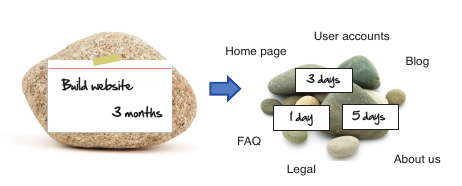
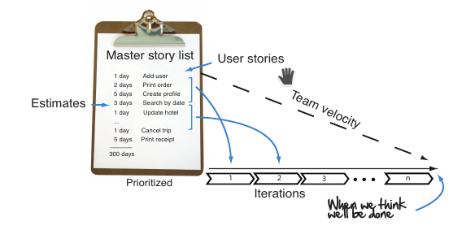
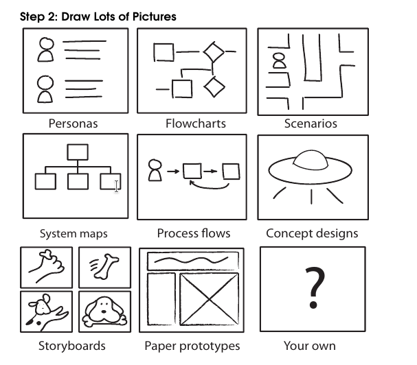

## Agile Notes:
Overview: 
(p17)

### Deliver Something of Value Every Week

- Look at software delivery from your customer’s point of view
    1. You break big problems down into smaller ones
    2. You focus on the really important stuff and forget everything else.
    3. You make sure that what you are delivering works.
    4. You go looking for feedback.
    5. You change course when necessary.
    6.  You become accountable.
- That means owning quality.
- That means owning the schedule
- That means setting expectations.

### How Does Agile Planning Work?

- The master story list is your project to-do list
    - Contains all the high-level features (user stories)
    - Forms basis of your project plan
    - Add estimates for each chunk / user story

- The Iteration
    - a one- to two-week period where you take your customers’ most important stories and transform them into running, tested software.
    - Team members will know how much they can take on by measuring the team velocity (how much you can get done per iteration).
    - When you and your team are faced with too much to do, you do the only thing you can—you do less. Being **flexible on scope** is how you’ll keep your plan balanced and your commitments real.

### Pictures are a great way to brainstorm ideas about the system and are a treasure trove for discovering stories.

Personas (descriptions of the people who are going to be using your sys-
tem) are good for getting to know your customers. Flowcharts, process
flows, and scenarios are great for role playing and really getting a feel
for how the system needs to work. 

Step 1: Get a Big Open Room
Step 2: Draw Lots of Pictures
Step 3: Write Lots of Stories
Step 4: Brainstorm Everything Else
Step 5: Scrub the List and Make It Shine

